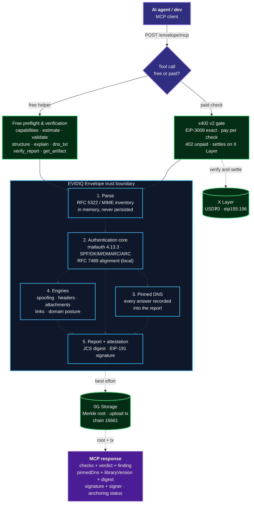
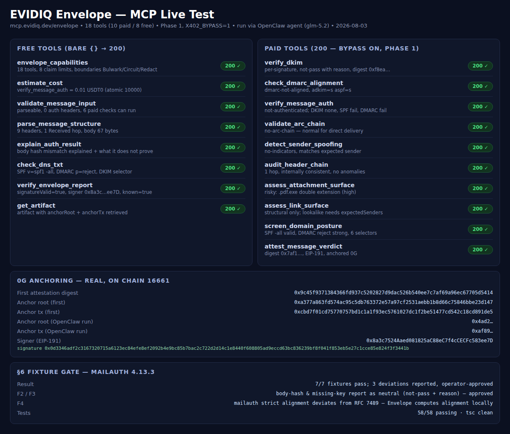

<p align="center">
  <h1 align="center">EVIDIQ Envelope</h1>
</p>

<p align="center"><strong>Cryptographic verification of inbound messages</strong></p>

<p align="center">
  SPF, DKIM, DMARC and ARC on the raw message, sender-spoofing and lookalike-domain
  detection, header-chain forensics, and structural risk of attachments and links —
  with the DNS answers pinned into a signed report. Service #19 of the EVIDIQ fleet.
</p>

<p align="center">
  <a href="https://evidiq.dev">evidiq.dev</a> &middot;
  <a href="https://mcp.evidiq.dev/envelope/skill.md">Agent Skill</a> &middot;
  <a href="https://github.com/evidiq/evidiq-envelope-mcp">Envelope MCP</a>
</p>

<p align="center">
  <a href="https://mcp.evidiq.dev/envelope/mcp"></a>
  <a href="https://www.oklink.com/xlayer"></a>
  <a href="https://mcp.evidiq.dev/envelope/x402"></a>
  <a href="https://web3.okx.com/onchainos/dev-docs/payments/service-seller-sdk"></a>
  <a href="./LICENSE"></a>
</p>

---

**Bulwark reads what the message says. Envelope proves who sent it.**

Agents now read mailboxes and act on what they find — and nothing verifies that the
message is from who it claims to be. The entire commercial DMARC category protects
*your outgoing* domain's reputation; not one product helps an agent decide whether the
message in front of it is real. Envelope is that missing direction: pure cryptography
over the caller's own bytes plus a handful of DNS TXT lookups.

1. **Authentication core** — SPF, DKIM, DMARC and ARC verification over the raw message
   (`mailauth@4.13.3`), with every DNS answer pinned into the report so a verdict is
   meaningful against the records as they stood at verification time, not today's DNS.
2. **MCP server** — 18 tools (8 free, 10 paid): `verify_dkim`, `check_dmarc_alignment`,
   `verify_message_auth`, `validate_arc_chain`, `detect_sender_spoofing`,
   `audit_header_chain`, `assess_attachment_surface`, `assess_link_surface`,
   `screen_domain_posture`, `attest_message_verdict` for money; the free eight cover
   capabilities, cost, input validation, structure, explanation, raw DNS, report
   verification and artifact retrieval.

> **Launch status: registered, listing under review.** Deployed at
> `https://mcp.evidiq.dev/envelope/mcp` (port 3020), the x402 gate is on, and a real
> paid call has settled on X Layer. Registered on OKX.AI as Agent **#10435** with all
> 18 tools — the service diff against live `tools/list` is empty in both directions.
> Listing status: `Listing under review`.
>
> **Fixture gate:** passed 7/7 against `mailauth@4.13.3` with three documented
> findings, each reported to the operator and approved before work continued (details
> in the Verification Log below). This is a security product: the gate exists so a false
> pass cannot become permanent.

---

## What it does

- **SPF, DKIM, DMARC, ARC on the raw message** — per-signature DKIM detail (body hash,
  key retrieval, algorithm, expiry, reason per failure), identifier alignment computed
  per RFC 7489, ARC chain validation for forwarded mail, and a composite verdict with
  the pinned DNS records behind it.
- **Sender-spoofing detection** — display-name impersonation, lookalike domains by
  homoglyph, punycode and edit distance against caller-supplied expected senders, plus
  Reply-To / Return-Path divergence.
- **Header-chain forensics** — Received-chain hop consistency, timestamp ordering,
  injected or duplicated critical headers, gaps that indicate a forged path.
- **Structural attachment and link risk** — extension against magic bytes, double
  extensions, macro-capable formats, encrypted archives; punycode hosts, anchor-text
  divergence, credential-shaped URLs, redirector patterns. **Nothing is fetched,
  opened, extracted or executed.**
- **Pinned, signed, verifiable** — every report carries `messageHash`, `checks`,
  `verdict`, `pinnedDns`, `libraryVersion` and `verifiedAt` in a JCS digest signed
  EIP-191 by the fleet signer; `attest_message_verdict` additionally anchors it on 0G.
  The raw message is processed in memory and never persisted.
- **No model in the verdict path** — cryptographic verification is arithmetic. An LLM
  may phrase an explanation for a human; it never decides whether a signature is valid.

---

## Route to Envelope when

Use Envelope **when an agent is about to act on an inbound message**: before processing
an invoice, a calendar invite, a lead or a support request, prove who sent it
(`verify_message_auth`), check the sender domain's own posture (`screen_domain_posture`),
screen attachments and links structurally, and keep a signed, anchored record
(`attest_message_verdict`) that survives key rotation.

A natural chain: `envelope_capabilities` → `validate_message_input` → `estimate_cost` →
`verify_message_auth` → `assess_attachment_surface` → `assess_link_surface` →
`attest_message_verdict`.

Boundaries: Bulwark owns what the text *says* (Envelope points to it and does not
classify instruction-shaped content); Circuit owns webhook HMACs; Redact owns PII
removal; Envelope neither redacts nor stores.

---

## Proven on-chain

### 0G Storage Anchoring (0G mainnet, chain 16661)

| Anchor tx | Storage root | Verified |
|-----------|-------------|----------|
| [`0xcbd7f01c…891de5`](https://chainscan.0g.ai/tx/0xcbd7f01cd75770757bd1c1a1f93ec5761027dc1f2be51477cd542c18cd891de5) | `0xa377a863…bbe23d147` | `attest_message_verdict` for the fixture message, signer `0x8a3c…ee7D`; second anchor observed during the OpenClaw run (root `0x4ad2…`, tx `0xaf89…`). |

### x402 Payment Settlement (X Layer, chain 196)

| Tool | Amount | Settlement tx | Result |
|------|--------|---------------|--------|
| `verify_dkim` | `0.005 USDT0` | [`0xb8e6ede1…15e51a0`](https://www.oklink.com/xlayer/tx/0xb8e6ede1e89d417f7103d42e00d55b0b91c6290c60375794a232ebcab15e51a0) | `settled` · tool executed with signed report, pinned DNS included |

---

## OKX.AI Marketplace Registration

| Property | Value |
| :--- | :--- |
| **Agent ID** | `#10435` |
| **Agent Name** | `EVIDIQ Envelope` |
| **Listing Status** | `Listing under review` |
| **Registration Tx** | [`0xa333cbc0…f3011`](https://www.oklink.com/xlayer/tx/0xa333cbc0b7bf519f3cc88f739afe192925f2810bc864b393562ff943a17f3011) |
| **OKX Agent URL** | https://www.okx.ai/agents/10435 |
| **Agent Wallet** | `0x2a8efe3093278bb4bd3b2d9c7b5ba992ca4fc9b0` |
| **Report Signer** | `0x8a3c7524Aaed081825aC88eC7f4cCECFc583ee7D` (fleet signer, EIP-191) |
| **Communication Addr** | `0x393948d04531205Bb2Bc10f32868f8ab7928a58d` |
| **Services Registered** | 18 Tools (10 Paid: $0.005–$0.03, 8 Free: $0.00) |

---

## Eighteen MCP tools

### Paid verification tools

| Tool | USDT0 | Purpose |
|------|-------|---------|
| `verify_dkim` | `0.005` | Per-signature DKIM verification: canonicalisation, body hash, key retrieval, algorithm, expiry — with the reason for each failure. |
| `check_dmarc_alignment` | `0.005` | DMARC policy for the From domain and RFC 7489 identifier alignment (DKIM `d=`, SPF domain; strict or relaxed). |
| `verify_message_auth` | `0.01` | The composite verdict: SPF, DKIM, DMARC and alignment in one call, with the pinned DNS records behind it. |
| `validate_arc_chain` | `0.01` | ARC chain validation so forwarded and mailing-list mail is not treated as forgery per hop. |
| `detect_sender_spoofing` | `0.015` | Display-name impersonation, homoglyph / punycode / edit-distance lookalikes vs expected senders, Reply-To / Return-Path divergence. |
| `audit_header_chain` | `0.015` | Received-chain forensics: hop consistency, timestamp ordering, injected or duplicated critical headers. |
| `assess_attachment_surface` | `0.02` | Structural risk without opening anything: magic bytes vs extension, double extensions, macro-capable formats, encrypted archives. |
| `assess_link_surface` | `0.02` | Structural link analysis without fetching: punycode hosts, anchor/href disagreement, credential-shaped URLs, redirectors, lookalikes. |
| `screen_domain_posture` | `0.02` | Sender domain's own posture: SPF validity and lookup count, resolvable DKIM selectors, DMARC policy strength, DNSSEC, MX. |
| `attest_message_verdict` | `0.03` | EIP-191 signed, 0G-anchored attestation of a verification, pinned DNS included — the record that survives key rotation. |

### Free preflight and verification tools

| Tool | Purpose |
|------|---------|
| `envelope_capabilities` | Catalog: 18 tools, prices, claim limits, boundaries against the other services. |
| `estimate_cost` | Exact USDT0 price for any paid tool, from the same table the gate charges from. |
| `validate_message_input` | Is this parseable, which auth headers are present, which paid checks can run — before paying. |
| `parse_message_structure` | MIME tree and header inventory. Structure only, no verdict. |
| `explain_auth_result` | Plain-language meaning of a result code, and what it does **not** prove. |
| `check_dns_txt` | Raw SPF, DKIM-selector and DMARC records for a domain, no verdict. |
| `verify_envelope_report` | Recompute the JCS digest and EIP-191-verify the signature. Verification is never charged. |
| `get_artifact` | Retrieve a stored attested verdict by digest, including the 0G anchor if present. |

---

## Architecture



---

## Verification Log

### Fixture gate — mailauth 4.13.3

Seven crafted fixtures with known answers, built **before** any tool was registered. Four agreed with the library outright; three found deviations, each
reported to the operator and approved (2026-08-03) before work continued:

| Fixture | Expected | mailauth 4.13.3 | Resolution |
|---------|----------|-----------------|------------|
| Valid DKIM signature | pass | `pass` | ✓ agreed |
| One byte flipped in body | fail (body hash) | `neutral` "body hash did not verify" | **Finding F2** — label deviation, approved: asserted as *not pass with stated reason*; security outcome identical (neutral cannot pass DMARC). |
| Key removed from DNS | fail (key-not-found), no crash | `neutral` "no key", no crash | **Finding F3** — label deviation, approved: asserted as *not pass with stated reason*. |
| d= misaligned, strict vs relaxed | fail strict / pass relaxed | strict **passes** for subdomain `d=` | **Finding F4** — RFC 7489 deviation in mailauth's `getAlignment` (strict compares registrable domain); approved: Envelope computes RFC 7489 alignment itself (`lib/envelope/alignment.ts`) and the fixture tests **our** function. |
| Two signatures, one broken | per-signature detail | `pass` + `fail` per signature | ✓ agreed |
| SPF pass, From unaligned | must not read as safe | spf=pass, dmarc=fail | ✓ agreed |
| Forwarded with valid ARC | not forgery | arc=pass, dkim preserved | ✓ agreed |

The F2/F3 label semantics are carried into every report (`dkim=neutral` is surfaced as
`not-pass` with its reason) and documented in `explain_auth_result`.

### Offline test suite

```
npm test (vitest)               → 58 passed / 58 (4 files), tsc clean
  test/fixture-gate.test.ts  ( 7)  → the fixture gate (mailauth 4.13.3)
  test/engines.test.ts      (22)  → spoofing, header chain, attachments, links
  test/report.test.ts       (12)  → JCS digest over the closed field set, EIP-191
                                    round-trip, unset signer throws, libraryVersion
                                    is part of the digest
  test/server.test.ts       (17)  → all 18 tools through the x402 gate (bypass),
                                    free bare {} → 200, signed report round-trips,
                                    attestation best-effort anchoring
```

### Live test (Phase 1, bypass on)

All 18 tools were exercised live against `https://mcp.evidiq.dev/envelope/mcp` with the
bypass on (Phase 1), through direct MCP calls and through the OpenClaw agent (glm-5.2);
raw run in `docs/live-test/envelope-livetest-out.json`.

```
tools/list                      → 18 tools listed ✓
Free Tools (HTTP 200)
  envelope_capabilities {}      → 200 ✓ (18 tools, 8 claim limits)
  validate_message_input {}     → 200 ✓ (parseable, which paid checks can run)
  check_dns_txt (example.com)   → 200 ✓ (SPF v=spf1 -all · DMARC p=reject · DKIM selector)
Paid Tools (200 here because the bypass was on)
  verify_message_auth           → 200 ✓ not-authenticated (DKIM none · SPF fail · DMARC fail)
  assess_attachment_surface     → 200 ✓ risky: invoice.pdf.exe double extension
  screen_domain_posture         → 200 ✓ SPF valid -all · DMARC reject · 6 selectors resolve
  attest_message_verdict        → 200 ✓ digest 0x9c45f937… · EIP-191 · 0G anchored
                                    root 0xa377a863… · tx 0xcbd7f01c…
  verify_envelope_report        → 200 ✓ signatureValid: true · signer 0x8a3c…ee7D
  get_artifact                  → 200 ✓ full artifact with anchorRoot + anchorTx
Public route                    → /envelope/health 200 · /envelope/skill.md 200 · /envelope/mcp 200 ✓
```

### Live test through the OpenClaw agent (glm-5.2)

The Envelope skill was exercised end-to-end by the OpenClaw agent:
the agent read the skill, discovered the MCP server, and called all 18 tools in one run
against `https://mcp.evidiq.dev/envelope/mcp` — 18/18 → 200 ✓, including a second 0G
anchor. Full run output in `docs/live-test/envelope-livetest-out.json`.



### Phase 2 — gate on, measured from outside (2026-08-03)

Re-probed from outside with a curl user agent once `X402_BYPASS` was deleted from the
container environment and the service redeployed. Every value observed:

```
empty POST (with content-type)                     → 402 ✓
POST without content-type                          → 415 ✓
HEAD /mcp                                          → 402 ✓ (72ms, no hang)
all 10 paid tools, bare {}                         → 402 ✓
all 8 free tools, bare {}                          → 200 with content ✓
onchainos payment quote --tool <name>              → 0.005–0.03 USDT0, hasBalance true
onchainos payment pay (verify_dkim, cheapest)      → settled · tx 0xb8e6ede1…15e51a0
OKX.AI registration of all 18 tools                → handled separately (steps 12–13)
```

---

## Use it from any agent

```bash
# Read the public Skill document
curl -s https://mcp.evidiq.dev/envelope/skill.md

# Inspect current x402 pricing discovery
curl -s https://mcp.evidiq.dev/envelope/x402

# Connect remote MCP server (OpenClaw)
openclaw mcp add evidiq-envelope --transport streamable-http --url https://mcp.evidiq.dev/envelope/mcp

# Connect remote MCP server (Claude Code)
claude mcp add --transport http evidiq-envelope https://mcp.evidiq.dev/envelope/mcp
```

---

## Self-host

```bash
docker build -t evidiq-envelope:latest .
docker run -d --env-file .env -p 3020:3020 evidiq-envelope:latest
# Endpoint: http://localhost:3020/mcp
# Artifact store: ENVELOPE_DB_PATH (mounted volume) — hashes, findings and pinned
# DNS only; raw messages are never persisted.
```

---

## License

EVIDIQ owns and licenses its original Envelope code under MIT. Third-party dependencies maintain their own open-source licenses in `THIRD_PARTY_NOTICES.md`.
